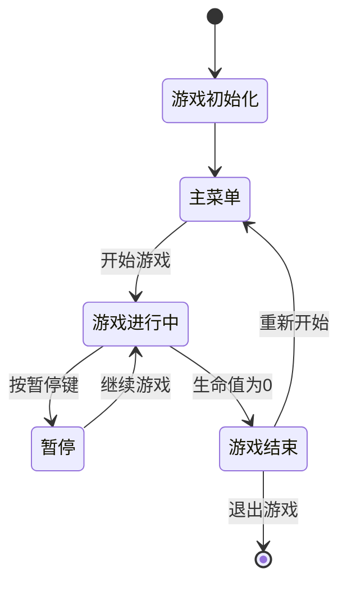

# 雷霆战机 - 设计文档

## 概述

雷霆战机是一个基于HTML5 Canvas和JavaScript的2D射击游戏。游戏采用面向对象的设计模式，使用游戏循环机制实现流畅的游戏体验。游戏包含15个关卡，每3关有一个BOSS战，支持关卡选择、暂停菜单、ESC键快捷操作等完整功能。

## 当前实现状态

✅ **核心功能已完成**
- 完整的游戏循环和状态管理
- 15关卡系统，包含BOSS关
- 玩家控制和自动射击
- 敌机生成和多种敌机类型
- 碰撞检测和生命值系统
- 评分系统和UI显示
- 关卡选择界面
- ESC暂停菜单功能
- 关卡切换和进度保存
- 音频管理系统
- 响应式设计

✅ **拓展功能已完成**
- 武器升级系统（5种武器类型：单发→双发→三发→散射→激光）
- 道具系统（武器升级、护盾、生命恢复、分数加倍道具）
- 粒子效果系统（爆炸、推进器火焰、子弹轨迹、星空背景）
- 成就系统（17个不同类型成就，自动解锁和通知）
- 排行榜系统（本地分数记录，新记录通知）
- 无尽模式（动态难度递增，波次系统，生存挑战）

🎯 **项目完成度**: 100% - 所有核心需求和拓展功能均已实现

## 架构

### 技术栈
- **前端**: HTML5, CSS3, JavaScript (ES6+)
- **图形渲染**: HTML5 Canvas API
- **输入处理**: Keyboard Event API
- **音效**: Web Audio API (可选)

### 整体架构
```
Game Engine
├── Game Manager (游戏管理器)
├── Renderer (渲染器)
├── Input Handler (输入处理器)
├── Collision Detector (碰撞检测器)
└── Game Objects (游戏对象)
    ├── Player (玩家飞机)
    ├── Enemy (敌方飞机)
    ├── Bullet (子弹)
    └── UI Elements (界面元素)
```

## 组件和接口

### 1. 游戏管理器 (GameManager)
负责游戏状态管理和主游戏循环。

```javascript
class GameManager {
    constructor(canvas)
    init()                    // 初始化游戏
    start()                   // 开始游戏
    pause()                   // 暂停游戏
    restart()                 // 重新开始
    gameLoop()                // 主游戏循环
    update(deltaTime)         // 更新游戏状态
    render()                  // 渲染游戏画面
    handleGameOver()          // 处理游戏结束
}
```

### 2. 游戏对象基类 (GameObject)
所有游戏实体的基类。

```javascript
class GameObject {
    constructor(x, y, width, height)
    update(deltaTime)         // 更新对象状态
    render(ctx)              // 渲染对象
    getBounds()              // 获取碰撞边界
    isOutOfBounds()          // 检查是否超出屏幕
    destroy()                // 销毁对象
}
```

### 3. 玩家飞机 (Player)
继承自GameObject，处理玩家控制和射击。

```javascript
class Player extends GameObject {
    constructor(x, y)
    move(direction)          // 移动飞机
    shoot()                  // 发射子弹
    takeDamage()             // 受到伤害
    isAlive()                // 检查是否存活
}
```

### 4. 敌方飞机 (Enemy)
继承自GameObject，自动向下移动。

```javascript
class Enemy extends GameObject {
    constructor(x, y, speed)
    update(deltaTime)        // 更新位置
    getScore()               // 获取击毁得分
}
```

### 5. 子弹 (Bullet)
继承自GameObject，直线移动的投射物。

```javascript
class Bullet extends GameObject {
    constructor(x, y, speed, direction)
    update(deltaTime)        // 更新位置
}
```

### 6. 输入处理器 (InputHandler)
处理键盘输入事件。

```javascript
class InputHandler {
    constructor()
    bindEvents()             // 绑定键盘事件
    isKeyPressed(key)        // 检查按键状态
    getMovementDirection()   // 获取移动方向
}
```

### 7. 碰撞检测器 (CollisionDetector)
处理游戏对象间的碰撞检测。

```javascript
class CollisionDetector {
    static checkCollision(obj1, obj2)  // 检查两个对象碰撞
    static checkBounds(obj, bounds)    // 检查边界碰撞
}
```

### 8. 游戏状态管理 (GameState)
管理游戏的不同状态。

```javascript
const GameStates = {
    MENU: 'menu',
    PLAYING: 'playing',
    PAUSED: 'paused',
    GAME_OVER: 'game_over'
}

class GameState {
    constructor()
    setState(state)          // 设置游戏状态
    getState()              // 获取当前状态
}
```

## 数据模型

### 游戏配置
```javascript
const GameConfig = {
    CANVAS_WIDTH: 800,
    CANVAS_HEIGHT: 600,
    PLAYER_SPEED: 300,        // 像素/秒
    BULLET_SPEED: 500,        // 像素/秒
    ENEMY_SPEED: 150,         // 像素/秒
    PLAYER_LIVES: 3,
    BULLET_INTERVAL: 200,     // 毫秒
    ENEMY_SPAWN_INTERVAL: 1500, // 毫秒
    ENEMY_SCORE: 10
}
```

### 游戏数据
```javascript
class GameData {
    constructor() {
        this.score = 0
        this.lives = GameConfig.PLAYER_LIVES
        this.level = 1
        this.gameObjects = []
        this.bullets = []
        this.enemies = []
    }
}
```

### 位置和尺寸
```javascript
class Vector2 {
    constructor(x, y)
    add(vector)
    multiply(scalar)
    normalize()
}

class Bounds {
    constructor(x, y, width, height)
    intersects(other)
    contains(point)
}
```

## 错误处理

### 1. 资源加载错误
- 图片资源加载失败时使用颜色矩形替代
- 音频资源加载失败时静默处理

### 2. 输入错误
- 无效按键输入被忽略
- 多重按键冲突时优先处理最后按下的键

### 3. 游戏状态错误
- 非法状态转换时回退到安全状态
- 游戏对象数组越界时进行边界检查

### 4. 性能问题
- 游戏对象数量过多时限制生成频率
- 帧率过低时降低游戏复杂度

## 测试策略

### 1. 单元测试
- 碰撞检测算法测试
- 游戏对象状态更新测试
- 输入处理逻辑测试
- 分数计算测试

### 2. 集成测试
- 游戏循环完整性测试
- 状态转换测试
- 对象生命周期测试

### 3. 用户体验测试
- 控制响应性测试
- 游戏平衡性测试
- 性能压力测试

### 4. 浏览器兼容性测试
- Chrome, Firefox, Safari, Edge兼容性
- 不同屏幕分辨率适配
- 移动设备触控支持（可选）

## 渲染策略

### 1. 图形资源
- 使用简单的几何图形（矩形、三角形）代替复杂图片
- 支持颜色填充和边框绘制
- 可选择性加载图片资源

### 2. 动画效果
- 爆炸效果：简单的粒子系统
- 移动动画：线性插值
- UI动画：淡入淡出效果

### 3. 性能优化
- 对象池模式减少垃圾回收
- 只渲染屏幕内的对象
- 使用requestAnimationFrame优化帧率

## 游戏流程



## 文件结构

```
thunder-fighter-game/
├── index.html              # 主页面
├── css/
│   └── style.css          # 样式文件
├── js/
│   ├── main.js            # 入口文件
│   ├── gameManager.js     # 游戏管理器
│   ├── gameObjects/       # 游戏对象
│   │   ├── gameObject.js  # 基类
│   │   ├── player.js      # 玩家飞机
│   │   ├── enemy.js       # 敌方飞机
│   │   └── bullet.js      # 子弹
│   ├── utils/             # 工具类
│   │   ├── inputHandler.js    # 输入处理
│   │   ├── collisionDetector.js # 碰撞检测
│   │   └── vector2.js     # 向量计算
│   └── config.js          # 游戏配置
└── assets/                # 资源文件（可选）
    ├── images/
    └── sounds/
```